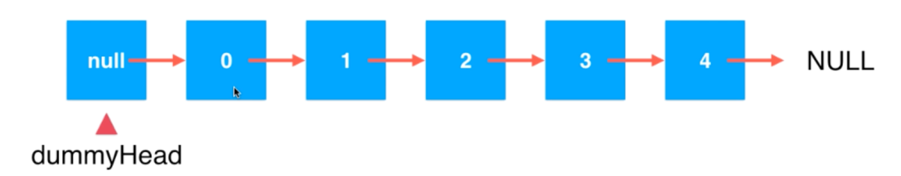

### 链表

为链表设立虚拟头节点

如图所示，可以很清晰的表示

###  关于链表的时间复杂度

1：addFirst(e)  O(1)
2: addLast(e) O(n)
3: add(index, e) O(2/n) = O(n);

删除操作同理

修改操作： set(index, e) O(n)
contains(e)  o(n)

对于链表而言：
增删改查的复杂度都是O(n)